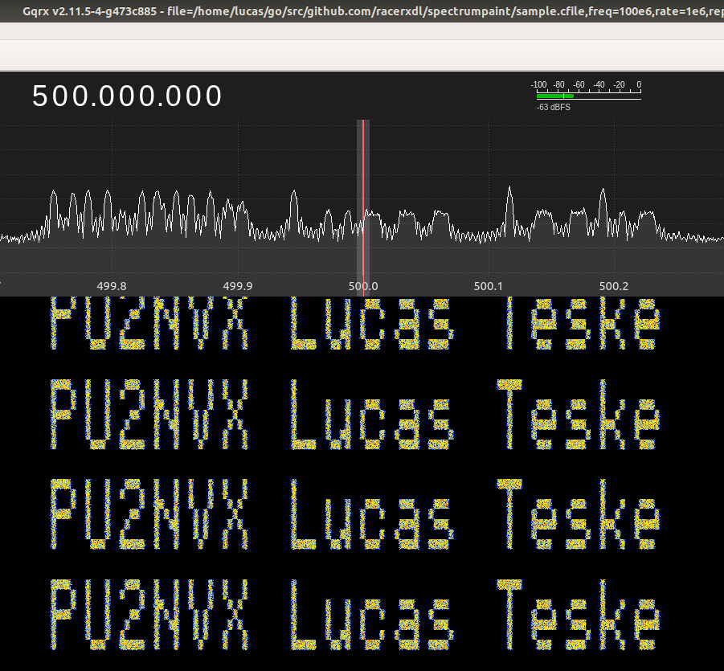
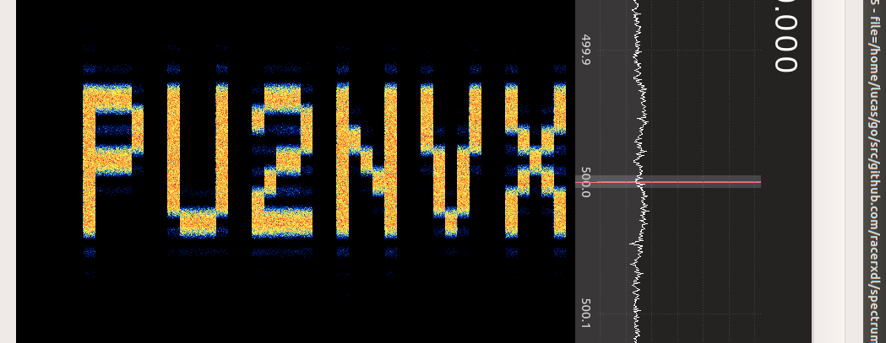

# SegDSP Spectrum Paint

Golang / SegDSP Spectrum Paint Generator


That's a very simple program that I did because I woke up too early. It uses SegDSP embedded Inverse FFT function to generate Spectrum Paints.
It also uses the same drawing mechanism as my LED Matrix Panel ([WiMatrix](https://github.com/racerxdl/wimatrix/)) uses to render fonts.

The software is pretty simple:

```bash
./painter --help
usage: painter --sampleRate=SAMPLERATE [<flags>] <text>

Flags:
  --help                     Show context-sensitive help (also try --help-long and --help-man).
  --sampleRate=SAMPLERATE    Sample Rate (in sps)
  --printSpeed=1             Print Speed in Chars / Second
  --gain=0                   Gain (in dB)
  --vertical                 Print each character vertically
  --filename="sample.cfile"  Name of the output file

Args:
  <text>  Text to paint
```

Examples
========

Vertical Print:
```bash
./painter --sampleRate=1000000 --printSpeed=2 --gain=10 --vertical "PU2NVX Lucas Teske"
```



Horizontal Print

```bash
./painter --sampleRate=1000000 --printSpeed=2 --gain=10 "PU2NVX   "
```




Have fun!